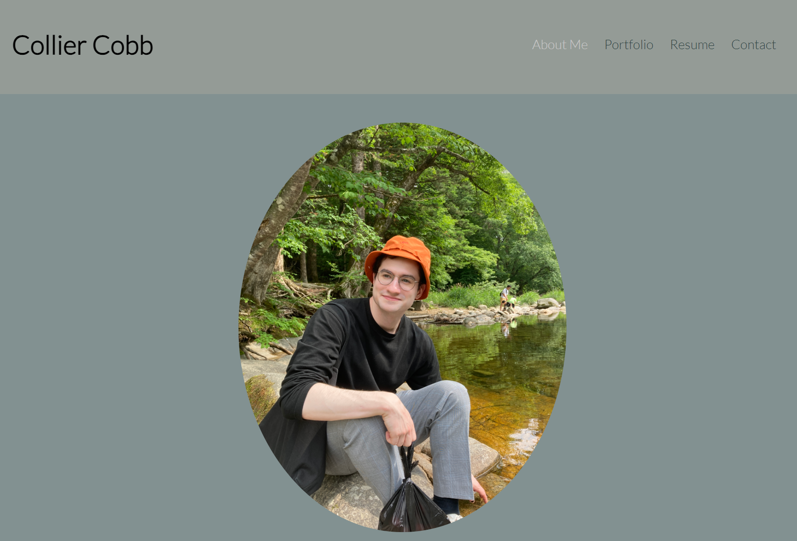

# My Portfolio

This web app showcases my projects and programming skills through React in order for employers to better assess my compatibility for a position.

## Usage

The portfolio can be accessed [here](https://main--dulcet-sherbet-81f59c.netlify.app/).

A preview can be seen below.

## Contributions

Company logos were accessed at the following links:

[Github logo](https://github.com/logos)

[LinkedIn logo](https://commons.wikimedia.org/wiki/File:LinkedIn_logo_initials.png) 

[Instagram logo](https://en.m.wikipedia.org/wiki/File:Instagram_logo_2022.svg)